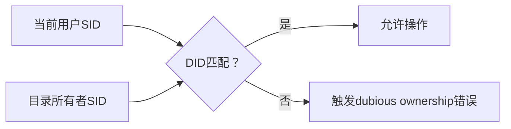

> 如果你是在使用自己的移动硬盘（U盘）操作项目时遇到的这个问题直接执行`git config --global --add safe.directory 'X:/path'`即可，只要你的移动硬盘（U盘）没有病毒就不会有安全问题。

## 深度解析Git错误：`fatal: detected dubious ownership in repository` 的根源与解决方案

> **"我的Git仓库突然拒绝操作了！"** —— 这是开发者遇到所有权错误时的典型反应。当你在Windows系统执行`git status`时突然看到鲜红的`fatal: detected dubious ownership in repository`错误，背后隐藏着Git强大的安全机制与操作系统权限的复杂博弈。

### 一、错误本质：Git的安全防护盾
```bash
fatal: detected dubious ownership in repository at 'X:/your/project/path'
To add an exception for this directory, call:
	git config --global --add safe.directory X:/your/project/path
```
**这个错误不是bug，而是Git精心设计的安全特性**。自Git 2.35.2（2022年发布）引入的`safe.directory`机制，专门防御以下风险：
1. **恶意脚本攻击**：阻止低权限进程篡改高权限用户的仓库
2. **权限提权漏洞**：防范通过Git操作获取系统权限（CVE-2022-24765）
3. **跨用户污染**：防止其他用户账户意外修改你的仓库

### 二、深层原理：所有权如何被检测？

- **SID（安全标识符）**：Windows为每个用户/组生成的唯一ID（如`S-1-5-21-3623811015-3361044348...`）
- **Git检测逻辑**：
  1. 获取当前进程用户的SID
  2. 读取仓库根目录的所有者SID
  3. 比对两者是否匹配
- **Unix系统对比**：在Linux/macOS中通过UID/GID实现类似检测

### 三、触发场景深度分析
| **场景**                | **典型案例**                          | **系统痕迹**                     |
|-------------------------|---------------------------------------|----------------------------------|
| 跨用户复制仓库          | 从管理员账户复制到普通用户            | 目录所有者仍为原用户            |
| 多账户共享目录          | 公司域账户与本地账户交替使用          | 用户Profile切换导致SID变化       |
| Docker/WSL2挂载         | Windows目录挂载到Linux子系统          | 文件元数据转换丢失所有权信息     |
| 外部存储设备            | 移动硬盘/NAS中的仓库                  | 设备迁移导致ACL重置             |

### 四、专业级解决方案矩阵

#### 方案1：安全目录白名单（推荐）
```bash
# 添加单个仓库到信任列表
git config --global --add safe.directory X:/your/project/path

# 递归添加所有子目录（谨慎使用！）
git config --global --add safe.directory '*'

# 查看已配置的安全目录
git config --global --get-all safe.directory
```
**适用场景**：个人开发机、可信环境  
**优势**：操作简单，保留安全机制  
**风险提示**：`'*'`会禁用所有权校验，仅限绝对可信环境

#### 方案2：所有权修复（永久性解决）
**Windows PowerShell操作：**
```powershell
# 获取当前用户SID
$mySid = [System.Security.Principal.WindowsIdentity]::GetCurrent().User.Value

# 接管目录所有权
TakeOwn /F "X:\your\project\path" /R /D Y

# 设置完全控制权限
icacls "X:\your\project\path" /grant:r "$($env:USERDOMAIN)\$($env:USERNAME):(OI)(CI)F" /T
```
**Linux/macOS终端：**
```bash
sudo chown -R $(id -u):$(id -g) /path/to/repo
```

#### 方案3：临时环境变量覆盖
```cmd
:: Windows CMD
set GIT_TEST_DEBUG_UNSAFE_DIRECTORIES=true
git status
```
**特点**：  
- 仅限临时调试
- 绕过安全检查（慎用！）
- 重启终端后失效

### 五、安全与便利的平衡艺术
1. **企业环境最佳实践**：
   ```ini
   # .gitconfig 分段配置示例
   [includeIf "gitdir:C:/work/projectA/"]
   	path = .gitconfig-projectA
   
   # .gitconfig-projectA
   [safe]
   	directory = C:/work/projectA
   ```
2. **跨平台协作建议**：
   - 在WSL2中使用`/mnt/c/`路径而非直接访问Windows目录
   - Docker挂载时添加`--user $(id -u):$(id -g)`参数

3. **安全审计技巧**：
   ```bash
   # 检查仓库目录ACL（Windows）
   icacls X:\your\project\path

   # Linux/macOS查看权限
   ls -ld /path/to/repo
   stat -c "%U %G" /path/to/repo
   ```

### 六、背后的安全哲学
此错误源于Git维护者Junio Hamano主导的**安全分层防御策略**：
> "我们宁愿让用户多一步配置，也要阻断潜在的提权漏洞" —— Git 2.35.2发布说明

通过`safe.directory`机制，Git实现了：
- ✅ 阻止恶意脚本在临时目录克隆仓库
- ✅ 防范共享服务器上的权限逃逸
- ✅ 保护系统关键目录不被意外修改

### 结语：理解错误背后的善意
`dubious ownership`错误如同Git世界的边境守卫，它的严格检查可能带来短暂不便，但正是这种对安全的偏执，守护着全球开发者的代码资产。掌握其原理后，下次再遇此错误时，你定能从容应对，在安全与效率间找到完美平衡点。

> **知识延伸**：关注Git的`fsmonitor`设置可进一步提升大型仓库性能，但需注意其与安全目录机制的交互影响，具体参考官方文档《Git Internals - Filesystem Monitoring》。

---

## Cover 图


